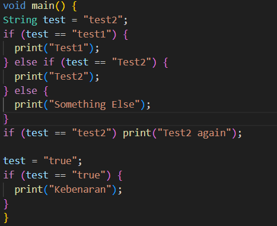
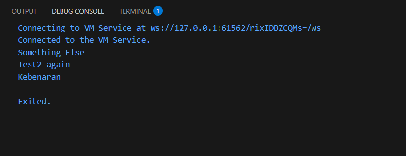
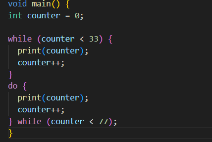
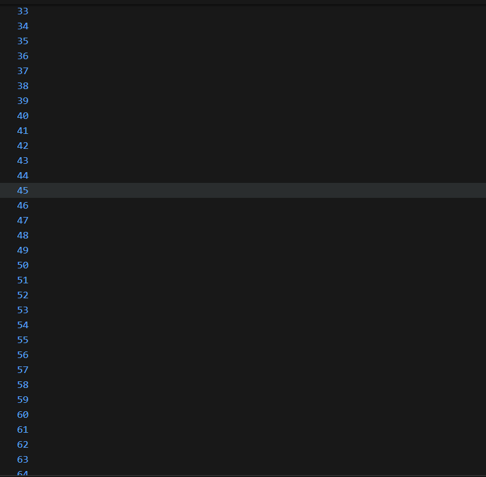
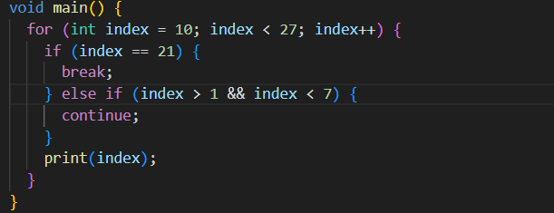

# Laporan Praktikum 01 : Pengantar Pemrograman Mobile

# Praktikum 1:

# Langkah 2
Jika kode ini dieksekusi, program akan menghasilkan Compile Error (kesalahan penyusunan kode). Program tidak akan menampilkan "Test2" atau "Test2 again"
Bahasa pemrograman (seperti Dart, Java, atau C#) bersifat case-sensitive (peka terhadap huruf besar dan kecil).
# Langkah 3
Masih Error

# Praktikum 2: 

# Langkah 2
masih error, karena saya belum mendekralariskan variabel counter
# Langkah 3
tidak error, tapi dia mengprint angka dari 33 sampai ke 77

# Praktikum 3

# Langkah 2
masih error, karena belum mendeklarasikan tipe data variabel tersebut dan disini dart sangat sensitif dengan huruf besar dan kecil sehingga error
# Langkah 3
masih error, Karena kata kunci If, Else If dan variabel Index tidak dikenali oleh dart. dan tidak bisa dirun karena logika continue menggunakan operator OR (||) maka akan selalu bernilai true. akibatnya, perintah print(index) tidak pernah jalan
[alt text](image-6.png)