# PRAKTIKUM PEMROGRAMAN MOBILE

| Atribut | Nilai                   |
| ------- | ----------------------- |
| Nama    | Ubaidillah Ulil A A     |
| NIM     | 244107060158            |
| Kelas   | SIB-2D                  |

# PRAKTIKUM 1 : Eksperimen Tipe Data List
# LANGKAH 1

# LANGKAH 2
Program berjalan lancar tanpa error dan mencetak nilai. karena pada assert semuanya bernilai true

# LANGKAH 3
.
Terjadi error karena list dibuat dengan nilai awal "null", Saya memperbaiki dengan menentukan tipe list agar bisa diisi "String" dan "null"

# PRAKTIKUM 2 : Eksperimen Tipe Data Set

# LANGKAH 1
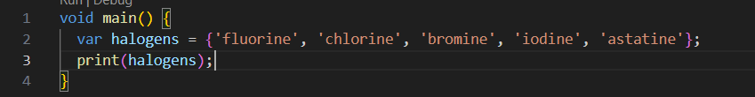

# LANGKAH 2
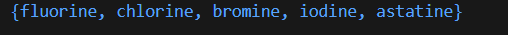
jika saya run, akan menampilkan isi set halogens yang berisi 5 elemen yang ada di set halogens itu.

# LANGKAH 3
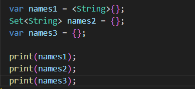
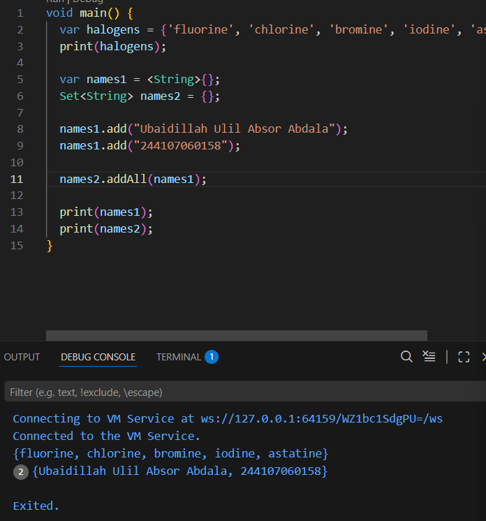
Jika saya run, akan menampilkan isi pada set names1

# PRAKTIKUM 3 : Eksperimen Tipe Data Maps

# LANGKAH 1
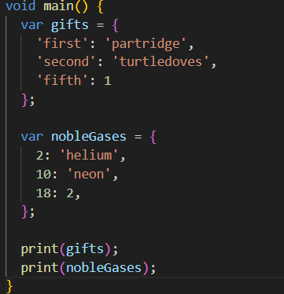

# LANGKAH 2
Jika saya run pada dart kode tersebut tidak akan error secara sintaksis namun memiliki perilaku penentuan tipe data otomatis

# LANGKAH 3
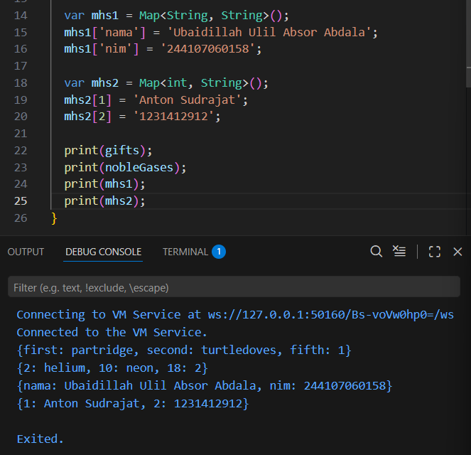
Ketika kode dijalankan, disini saya membuat dua map baru yaitu mhs 1 dengan key value String dan mhs 2 dengan key value int dan String

# PRAKTIKUM 4 : Eksperimen Tipe Data List: Spread dan Control-flow Operators

# LANGKAH 1
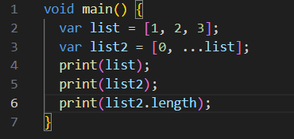

# LANGKAH 2
Jika saya run, akan terjadi error karena list1 tidak pernah dideklarasikan

# LANGKAH 3
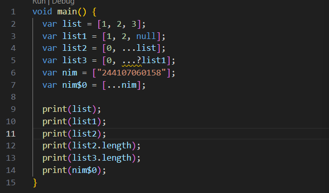
Jika Saya run, akqn mencetak variabel list dan mencetak panjang list.

# LANGKAH 4
Jika True
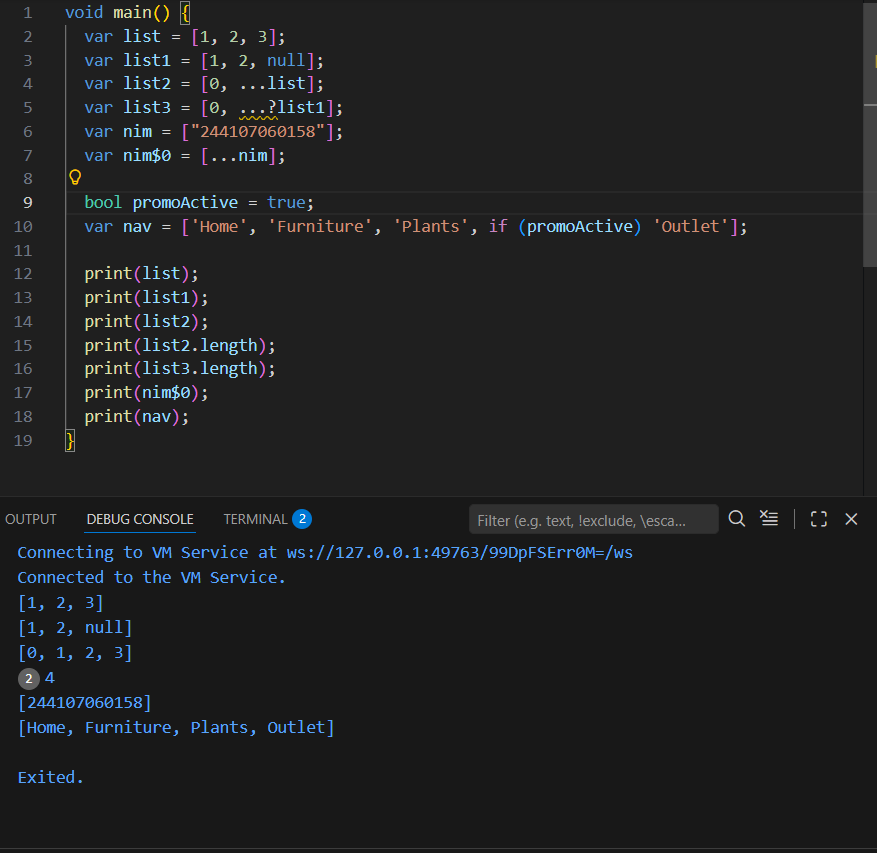
Jika False
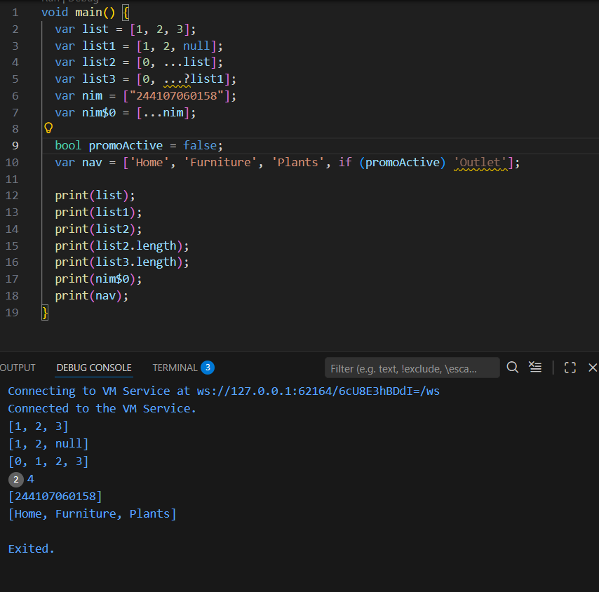
Jika Saya run maka akan terjadi error karena promoActive belum dideklarasikan, jika True maka akan muncul Outlet dan jika false maka Outlet tidak muncul.

# LANGKAH 5
Jika kondisi Variable Manager
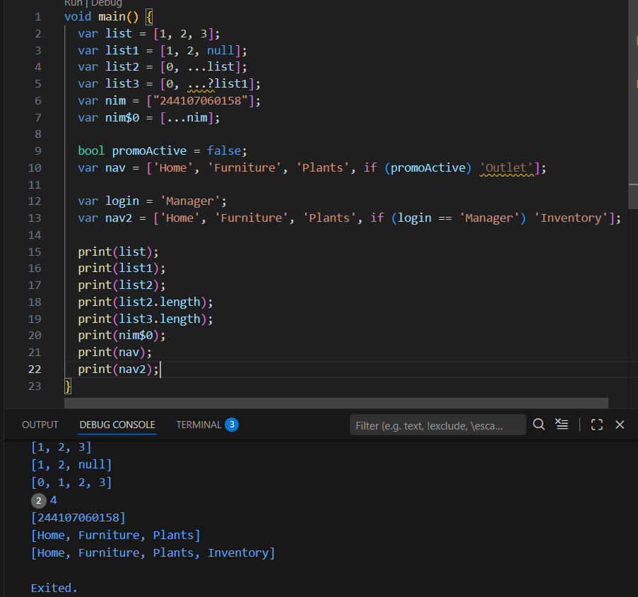
Jika kondisi Variable User
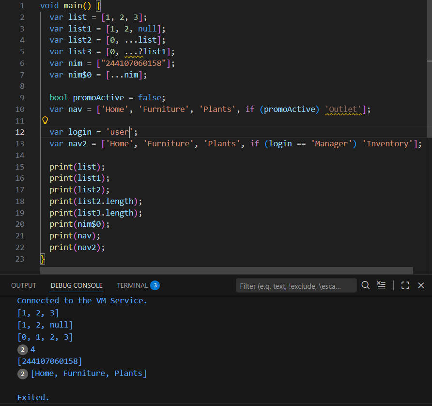
Jika nilai variabel login adalah 'Manager', maka elemen 'Inventory' akan ditambahkan ke dalam list. Jika bukan 'Manager', maka elemen tersebut tidak akan dimasukkan.

# LANGKAH 6
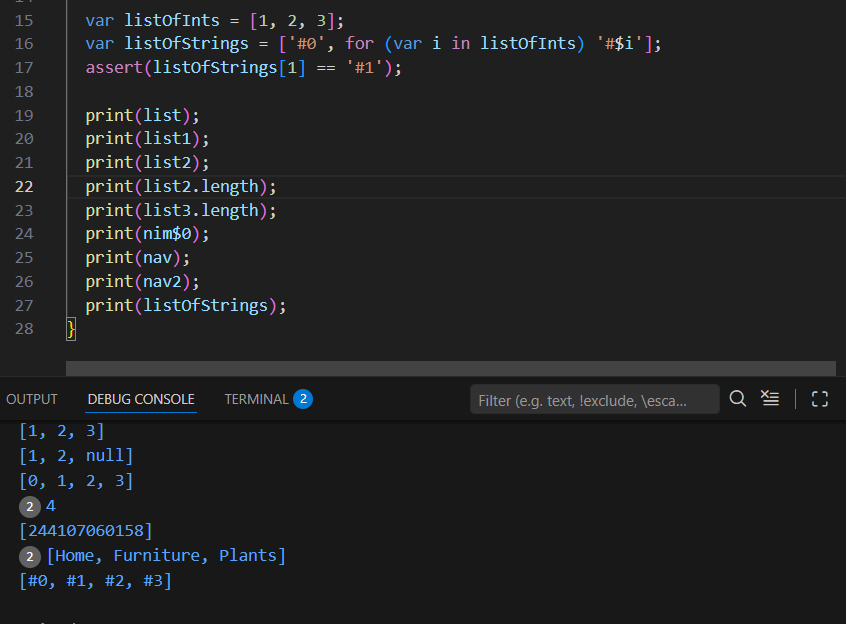
Program berjalan tanpa error dan assert memastikan bahwa indeks ke-1 adalah #1

# PRAKTIKUM 5 : Eksperimen Tipe Data Records

# LANGKAH 1
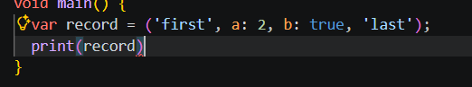

# LANGKAH 2
Error Karena tidak ada titik koma setelah print(record)
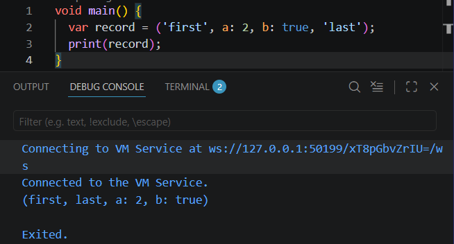
Program akan membuat sebuah Record yang berisi beberapa nilai dengan tipe data berbeda. Record memungkinkan penyimpanan data positional dan named fields dalam satu variabel, kemudian ditampilkan menggunakan fungsi print().

# LANGKAH 3
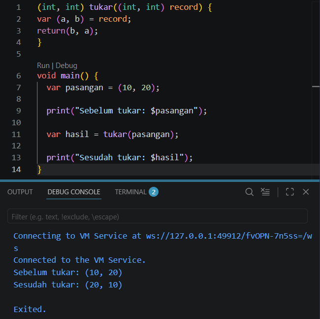
Jika kode tukar() ditempatkan diluar main(), dan dijalankan maka tidak ada error karena record sudah true. fungsi ini menerima record (int, int) lalu menukar isinya menggunakan pattern matching.

# LANGKAH 4
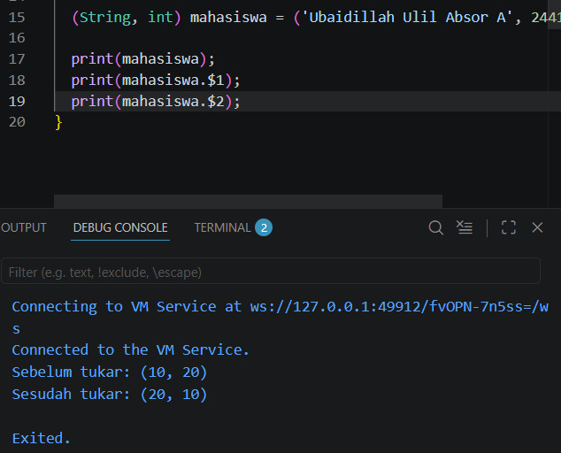
terjadi error karena variabel record mahasiswa sudah dideklarasikan tetapi belum diberikan nilai.

# LANGKAH 5
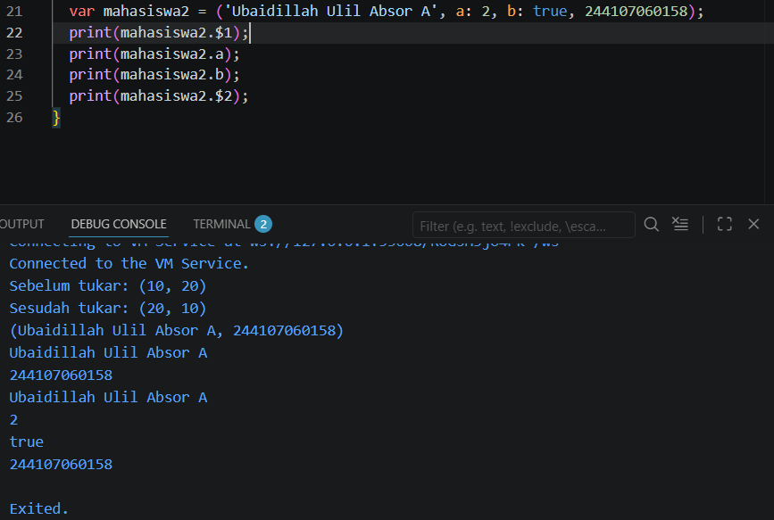
Jika saya run maka akan menampilkan NIM saya karena kondisi true. salah satu field record diganti dengan nama dan NIM, program berjalan normal dan mencetak nilai nilai record sesuai urutan aksesnya.

# TUGAS
2. Jelaskan yang dimaksud Functions dalam bahasa Dart!
Function adalah blok kode yang digunakan untuk menjalankan tugas tertentu dan bisa dipanggil berulang kali. Function membantu membuat program lebih rapi, modular, dan mudah digunakan kembali.

3. Jelaskan jenis-jenis parameter di Functions beserta contoh sintaksnya!
Positional parameter → parameter yang harus diisi sesuai urutan.
Optional positional parameter → parameter yang boleh diisi atau tidak (opsional).
Named parameter → parameter dipanggil menggunakan nama sehingga tidak tergantung urutan.
Required named parameter → parameter bernama yang wajib diisi.

4. Jelaskan maksud Functions sebagai first-class objects beserta contoh sintaknya!
* disimpan ke dalam variabel
* dikirim sebagai parameter ke function lain
* dikembalikan sebagai hasil dari function

5. Apa itu Anonymous Functions? Jelaskan dan berikan contohnya!
Anonymous function adalah function yang tidak memiliki nama. Biasanya digunakan untuk tugas singkat dan hanya dipakai satu kali. Anonymous function sering digunakan ketika function dibutuhkan secara langsung tanpa harus membuat function terpisah

6. Jelaskan perbedaan Lexical scope dan Lexical closures! Berikan contohnya!
* Lexical Scope adalah aturan bahwa suatu variabel hanya bisa diakses dalam lingkup tempat variabel tersebut dibuat. Function yang berada di dalam lingkup tersebut masih bisa mengaksesnya.
* Lexical Closures adalah kondisi di mana function tetap "mengingat" variabel dari lingkup luar, walaupun function tersebut dijalankan di tempat lain. Jadi function membawa akses ke variabel luar tersebut.

7. Jelaskan dengan contoh cara membuat return multiple value di Functions!
Return multiple value berarti function mengembalikan lebih dari satu nilai.
* Menggunakan List (mengembalikan data dalam bentuk urutan).
* Menggunakan Map (mengembalikan data dalam bentuk pasangan kunci dan nilai).
* Menggunakan Record (cara modern untuk mengembalikan beberapa nilai sekaligus).