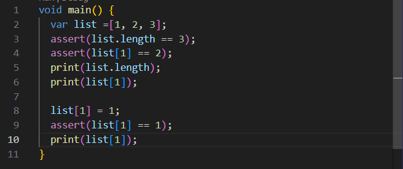
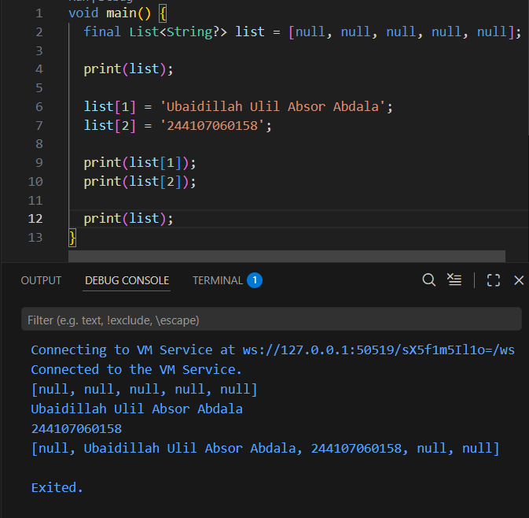

# PRAKTIKUM PEMROGRAMAN MOBILE

# PRAKTIKUM 1 : Eksperimen Tipe Data List
# LANGKAH 1

# LANGKAH 2
Program berjalan lancar tanpa error dan mencetak nilai. karena pada assert semuanya bernilai true

# LANGKAH 3
.
Terjadi error karena list dibuat dengan nilai awal "null", Saya memperbaiki dengan menentukan tipe list agar bisa diisi "String" dan "null"