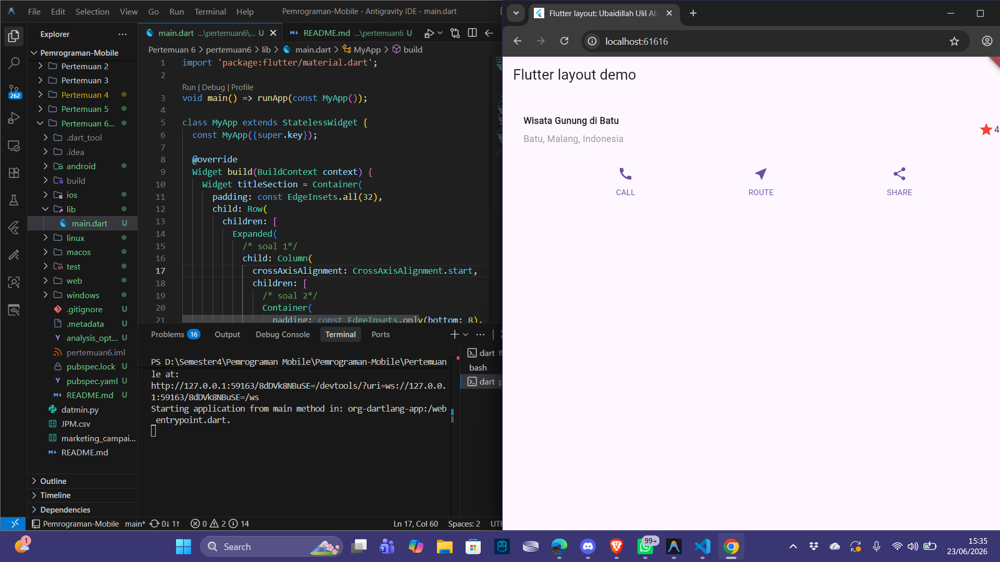
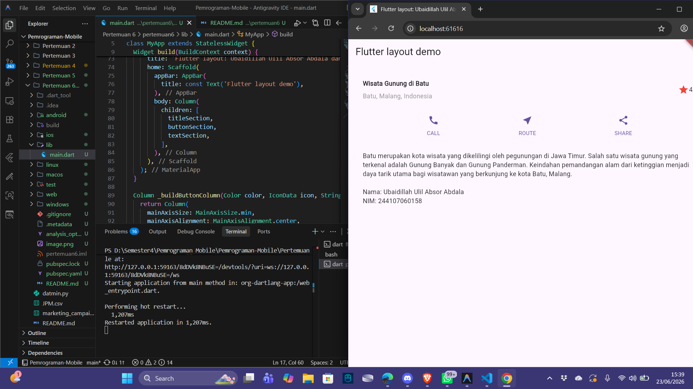

# Laporan Praktikum Pertemuan 6: Layouting di Flutter

| Atribut | Nilai |
| --- | --- |
| Nama | Ubaidillah Ulil Absor Abdala |
| NIM | 244107060158 |
| Kelas | SIB-2D |

## Langkah 4: Implementasi Title Row

Pada Langkah 4, terdapat 3 bagian kode yang ditandai sebagai `soal 1`, `soal 2`, dan `soal 3`. Berikut adalah penjelasan mengenai jawaban untuk masing-masing soal tersebut:

### **Jawaban Soal 1**
Di dalam widget `Expanded`, kode mendefinisikan sebuah `Column` sebagai child-nya. Agar teks judul dan teks lokasi berbaris sejajar ke arah kiri secara vertikal, kita mengisi properti alignment horizontal kolom tersebut:
```dart
crossAxisAlignment: CrossAxisAlignment.start,
```
**Penjelasan:** `CrossAxisAlignment.start` digunakan untuk meratakan seluruh widget anak (children) di dalam `Column` agar dimulai dari sisi kiri (start) sumbu silang (horizontal).

---

### **Jawaban Soal 2**
Di bagian pembungkus teks judul utama (`Wisata Gunung di Batu`), diberikan sebuah `Container` yang mengatur jarak padding di bagian bawah teks:
```dart
padding: const EdgeInsets.only(bottom: 8),
```
**Penjelasan:** Properti ini memberikan jarak padding sebesar `8.0` piksel hanya di sisi bawah (`bottom`) teks judul utama agar tidak menempel terlalu dekat dengan teks lokasi di bawahnya.

---

### **Jawaban Soal 3**
Di bagian paling kanan baris (`Row`), ditambahkan sebuah ikon bintang berwarna merah beserta teks angka `41`:
```dart
Icon(
  Icons.star,
  color: Colors.red[500],
),
const Text('41'),
```
**Penjelasan:** 
- `Icons.star` digunakan untuk menampilkan ikon bintang terisi (solid star).
- `color: Colors.red[500]` mewarnai bintang tersebut dengan warna merah dengan intensitas/kecerahan 500.
- `const Text('41')` menampilkan teks string angka `41` di sebelah kanan ikon bintang sebagai representasi nilai rating/ulasan.


# PRAKTIKUM 2

Di dalam Praktikum 2, kita mengimplementasikan tata letak tombol (button row) yang berisi 3 tombol aksi: CALL, ROUTE, dan SHARE. Berikut adalah penjelasan mengenai implementasi kodenya:

### **1. Method `_buildButtonColumn`**
Fungsi pembantu pribadi (private helper method) `_buildButtonColumn` dibuat untuk membangun kolom tombol secara dinamis dan seragam:
```dart
Column _buildButtonColumn(Color color, IconData icon, String label) {
  return Column(
    mainAxisSize: MainAxisSize.min,
    mainAxisAlignment: MainAxisAlignment.center,
    children: [
      Icon(icon, color: color),
      Container(
        margin: const EdgeInsets.only(top: 8),
        child: Text(
          label,
          style: TextStyle(
            fontSize: 12,
            fontWeight: FontWeight.w400,
            color: color,
          ),
        ),
      ),
    ],
  );
}
```
**Penjelasan:**
- Fungsi ini menerima parameter `color` untuk warna tema, `icon` untuk jenis ikon, dan `label` untuk teks keterangan.
- `mainAxisSize: MainAxisSize.min` digunakan agar kolom hanya memakan ruang sekecil mungkin sesuai kontennya.
- `Container` dengan `margin: const EdgeInsets.only(top: 8)` memberikan jarak antara ikon di atas dengan teks label di bawahnya.

---

### **2. Widget `buttonSection`**
Bagian baris tombol dideklarasikan tepat di bawah `titleSection` dengan memanggil method `_buildButtonColumn`:
```dart
Color color = Theme.of(context).primaryColor;

Widget buttonSection = Row(
  mainAxisAlignment: MainAxisAlignment.spaceEvenly,
  children: [
    _buildButtonColumn(color, Icons.call, 'CALL'),
    _buildButtonColumn(color, Icons.near_me, 'ROUTE'),
    _buildButtonColumn(color, Icons.share, 'SHARE'),
  ],
);
```
**Penjelasan:**
- `Theme.of(context).primaryColor` mengambil warna utama dari tema aplikasi saat ini untuk mewarnai tombol.
- `MainAxisAlignment.spaceEvenly` membagi ruang sisa secara rata sebelum, di antara, dan sesudah setiap tombol agar letaknya simetris dan rapi.

# Dokumentasi praktikum 2



# PRAKTIKUM 3

Di dalam Praktikum 3, kita mengimplementasikan widget bagian teks deskripsi (text section) untuk menampilkan detail mengenai tempat wisata yang ditunjukkan. Berikut adalah penjelasan kodenya:

### **1. Widget `textSection`**
Bagian deskripsi teks dibungkus dalam sebuah `Container` dengan padding di semua sisinya:
```dart
Widget textSection = Container(
  padding: const EdgeInsets.all(32),
  child: const Text(
    'Batu merupakan kota wisata yang dikelilingi oleh pegunungan di Jawa Timur. '
    'Salah satu wisata gunung yang terkenal adalah Gunung Banyak dan Gunung Panderman. '
    'Keindahan pemandangan alam dari ketinggian menjadi daya tarik utama bagi wisatawan '
    'yang berkunjung ke kota Batu, Malang.\n\n'
    'Nama: Ubaidillah Ulil Absor Abdala\n'
    'NIM: 244107060158',
    softWrap: true,
  ),
);
```
**Penjelasan:**
- `padding: const EdgeInsets.all(32)` digunakan untuk memberikan ruang kosong sebesar `32` piksel di sekeliling teks agar teks deskripsi tidak menempel langsung ke tepi layar.
- `softWrap: true` memastikan bahwa jika teks terlalu panjang dan melebihi lebar layar, maka teks tersebut secara otomatis akan dibungkus dan turun ke baris berikutnya di batas kata, alih-alih terpotong.
- Teks yang digunakan disesuaikan dengan destinasi wisata gunung di kota Batu serta menyertakan identitas Nama & NIM mahasiswa sebagai laporan praktikum.

---

### **2. Integrasi ke Body Scaffold**
Menambahkan widget `textSection` ke dalam child list `Column` pada `Scaffold` body:
```dart
body: Column(
  children: [
    titleSection,
    buttonSection,
    textSection,
  ],
),
```
# Dokumentasi praktikum 3


# PRAKTIKUM 4

Di dalam Praktikum 4, kita mengimplementasikan widget bagian gambar (image section) yang menampilkan foto tempat wisata. Berikut adalah penjelasan kodenya:

### **1. Konfigurasi Aset di `pubspec.yaml`**
Kita membuat folder `images` di root project dan memindahkan file foto `fotoalin.jpeg` ke dalamnya. Lalu, kita mendaftarkan file gambar tersebut pada file `pubspec.yaml` di bawah bagian `assets`:
```yaml
flutter:
  uses-material-design: true
  assets:
    - images/fotoalin.jpeg
```
**Penjelasan:** Deklarasi ini wajib dilakukan agar Flutter mengenali file gambar tersebut sebagai asset lokal yang sah dan mengemasnya ke dalam build aplikasi.

---

### **2. Menambahkan Gambar ke Body Column**
Di dalam kelas `MyApp` (pada file `main.dart`), kita menambahkan `Image.asset` secara langsung ke dalam list `children` pada body `Column`:
```dart
body: Column(
  children: [
    Image.asset(
      'images/fotoalin.jpeg',
      width: 600,
      height: 240,
      fit: BoxFit.cover,
    ),
    titleSection,
    buttonSection,
    textSection,
  ],
),
```
**Penjelasan:**
- `Image.asset('images/fotoalin.jpeg', ...)` digunakan untuk menampilkan gambar lokal `fotoalin.jpeg` yang tersimpan di dalam folder `images`.
- `width: 600` dan `height: 240` menetapkan ukuran lebar dan tinggi area box gambar.
- `fit: BoxFit.cover` memberi tahu Flutter agar memotong gambar seminimal mungkin (cropping) sehingga gambar memenuhi area box dimensi yang ditentukan tanpa merusak aspek rasionya.
- Seluruh elemen (Gambar, Judul, Tombol, Teks) disusun secara vertikal berurutan dari atas ke bawah menggunakan widget `Column`.

# Dokumentasi praktikum 4
