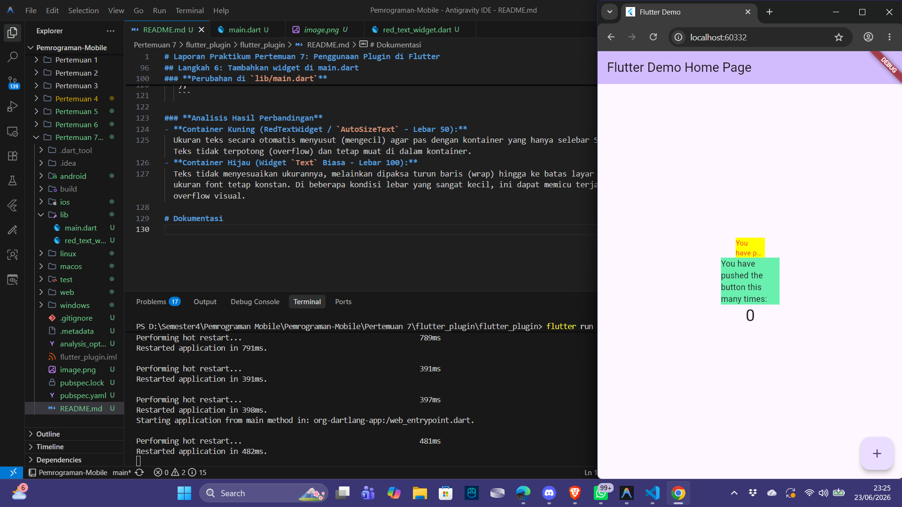

# Laporan Praktikum Pertemuan 7: Penggunaan Plugin di Flutter

| Atribut | Nilai |
| --- | --- |
| Nama | Ubaidillah Ulil Absor Abdala |
| NIM | 244107060158 |
| Kelas | SIB-2D |

## Langkah 2: Menambahkan Plugin

Pada langkah ini, kita menambahkan plugin `auto_size_text` ke dalam proyek Flutter. Plugin ini berguna agar ukuran teks otomatis menyesuaikan (menyusut atau membesar) dengan area batas kontainer teks yang tersedia, guna mencegah terjadinya overflow layout pada teks yang dinamis.

### **Perintah Terminal**
Untuk menambahkan plugin ini, jalankan perintah berikut pada root directory proyek:
```bash
flutter pub add auto_size_text
```

### **Hasil Verifikasi di `pubspec.yaml`**
Setelah perintah di atas sukses dijalankan, dependency `auto_size_text` otomatis terdaftar pada file `pubspec.yaml` di bawah section `dependencies:` seperti berikut:
```yaml
dependencies:
  flutter:
    sdk: flutter

  cupertino_icons: ^1.0.8
  auto_size_text: ^3.0.0
```

## Langkah 3: Buat file red_text_widget.dart

Pada langkah ini, kita membuat sebuah widget kustom yang diberi nama `RedTextWidget` di dalam file `lib/red_text_widget.dart`. Saat ini, widget tersebut hanya mengembalikan sebuah `Container` kosong.

### **Kode Implementasi (`lib/red_text_widget.dart`)**
```dart
import 'package:flutter/material.dart';

class RedTextWidget extends StatelessWidget {
  const RedTextWidget({Key? key}) : super(key: key);

  @override
  Widget build(BuildContext context) {
    return Container();
  }
}
```

## Langkah 4: Tambah Widget AutoSizeText

Pada langkah ini, kita mengubah pengembalian widget di dalam `RedTextWidget` yang sebelumnya mengembalikan `Container()` kosong menjadi widget `AutoSizeText` dari package `auto_size_text`.

### **Kode Implementasi (`lib/red_text_widget.dart`)**
```dart
import 'package:flutter/material.dart';
import 'package:auto_size_text/auto_size_text.dart';

class RedTextWidget extends StatelessWidget {
  final String text;
  
  const RedTextWidget({Key? key, required this.text}) : super(key: key);

  @override
  Widget build(BuildContext context) {
    return AutoSizeText(
      text,
      style: const TextStyle(color: Colors.red, fontSize: 14),
      maxLines: 2,
      overflow: TextOverflow.ellipsis,
    );
  }
}
```

### **Pertanyaan Praktikum: Mengapa Terjadi Error Info?**
Setelah menambahkan kode widget `AutoSizeText` pertama kali seperti pada panduan modul, kita akan menemui beberapa info error. Berikut adalah penjelasannya:

1. **Error: Undefined class 'AutoSizeText' (Belum Melakukan Import)**
   - **Penyebab:** Kelas `AutoSizeText` adalah bagian dari package eksternal `auto_size_text`. Jika kita belum menambahkan baris import `import 'package:auto_size_text/auto_size_text.dart';` di bagian atas file `red_text_widget.dart`, Dart compiler tidak dapat mengenali kelas tersebut.
   - **Solusi:** Menambahkan import library `auto_size_text` di bagian paling atas file.

2. **Error: Undefined name 'text' (Variabel belum dideklarasikan)**
   - **Penyebab:** Di dalam kode kita memanggil variabel `text` (`AutoSizeText(text, ...)`), namun variabel `text` tersebut belum dideklarasikan sebagai variabel anggota (property) kelas `RedTextWidget` maupun diterima melalui constructor kelas tersebut.
   - **Solusi:** Menambahkan deklarasi properti `final String text;` dan menambahkannya ke parameter constructor: `const RedTextWidget({Key? key, required this.text}) : super(key: key);`.

## Langkah 5: Buat Variabel text dan parameter di constructor

Pada langkah ini, kita menyelesaikan error "Undefined name 'text'" dari Langkah 4 dengan cara mendeklarasikan variabel `text` di dalam kelas `RedTextWidget` dan memasukkannya ke parameter constructor kelas tersebut.

### **Kode Tambahan pada Kelas `RedTextWidget`**
```dart
final String text;

const RedTextWidget({Key? key, required this.text}) : super(key: key);
```

## Langkah 6: Tambahkan widget di main.dart

Pada langkah ini, kita mengimpor `RedTextWidget` di dalam `main.dart` dan membandingkan perilaku `RedTextWidget` (yang menggunakan `AutoSizeText`) dengan widget `Text` biasa di dalam container dengan lebar yang dibatasi (constrained width).

### **Perubahan di `lib/main.dart`**
1. **Import:**
   ```dart
   import 'package:flutter_plugin/red_text_widget.dart';
   ```
2. **Implementasi di widget `children`:**
   ```dart
   Container(
      color: Colors.yellowAccent,
      width: 50,
      child: const RedTextWidget(
                text: 'You have pushed the button this many times:',
             ),
   ),
   Container(
       color: Colors.greenAccent,
       width: 100,
       child: const Text(
              'You have pushed the button this many times:',
             ),
   ),
   ```

### **Analisis Hasil Perbandingan**
- **Container Kuning (RedTextWidget / `AutoSizeText` - Lebar 50):** 
  Ukuran teks secara otomatis menyusut (mengecil) agar pas dengan kontainer yang hanya selebar 50 piksel. Teks tidak terpotong (overflow) dan tetap muat di dalam kontainer.
- **Container Hijau (Widget `Text` Biasa - Lebar 100):**
  Teks tidak menyesuaikan ukurannya, melainkan dipaksa turun baris (wrap) hingga ke batas layar karena ukuran font tetap konstan. Di beberapa kondisi lebar yang sangat kecil, ini dapat memicu terjadinya overflow visual.

# Dokumentasi
