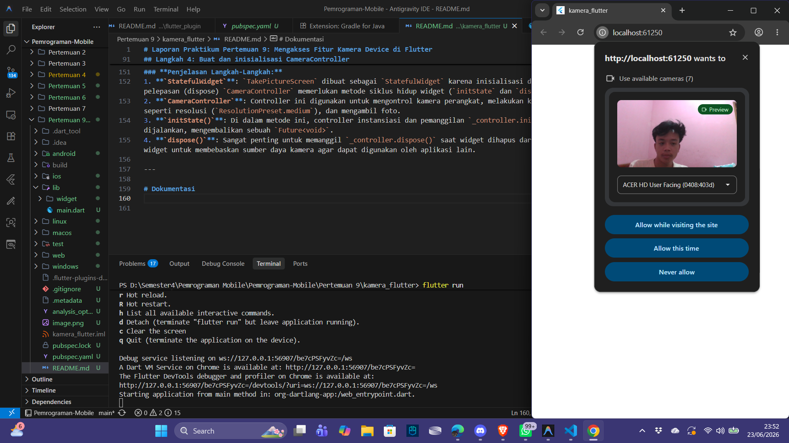

# Laporan Praktikum Pertemuan 9: Mengakses Fitur Kamera Device di Flutter

| Atribut | Nilai |
| --- | --- |
| Nama | Ubaidillah Ulil Absor Abdala |
| NIM | 244107060158 |
| Kelas | SIB-2D |

## Langkah 2: Tambah Dependensi yang Diperlukan

Pada praktikum ini, kita memerlukan tiga dependensi tambahan untuk mengelola fitur kamera dan penyimpanan file:
1. **`camera`**: Untuk mengakses dan berinteraksi dengan hardware kamera perangkat.
2. **`path_provider`**: Untuk mencari direktori/path penyimpanan yang sesuai pada perangkat (misal temporary directory atau documents directory).
3. **`path`**: Untuk membuat manipulasi jalur file yang kompatibel dengan berbagai platform (Android/iOS).

### **1. Menambahkan Dependensi Melalui Terminal**
Kita menginstal ketiga package tersebut dengan menjalankan perintah berikut di terminal root proyek:
```bash
flutter pub add camera path_provider path
```

### **Hasil Verifikasi di `pubspec.yaml`**
Setelah sukses, dependensi berikut otomatis terdaftar di file `pubspec.yaml`:
```yaml
dependencies:
  flutter:
    sdk: flutter

  cupertino_icons: ^1.0.8
  camera: ^0.12.0+1
  path_provider: ^2.1.6
  path: ^1.9.1
```

---

### **2. Konfigurasi Khusus Platform (Android & iOS)**

#### **Android (`android/app/build.gradle.kts`)**
Kamera pada Android membutuhkan minimal Android SDK versi 21. Kita mengonfigurasinya dengan mengubah properti `minSdk` di dalam `defaultConfig`:
```kotlin
defaultConfig {
    applicationId = "com.example.kamera_flutter"
    minSdk = 21
    targetSdk = flutter.targetSdkVersion
    versionCode = flutter.versionCode
    versionName = flutter.versionName
}
```

#### **iOS (`ios/Runner/Info.plist`)**
Pada iOS, kita menambahkan deskripsi izin kamera dan mikrofon di dalam file `Info.plist` agar aplikasi dapat meminta izin akses ke perangkat keras:
```xml
<key>NSCameraUsageDescription</key>
<string>Explanation on why the camera access is needed.</string>
<key>NSMicrophoneUsageDescription</key>
<string>Explanation on why the microphone access is needed.</string>
```

## Langkah 3: Ambil Sensor Kamera dari Device

Pada langkah ini, kita menginisialisasi layanan plugin Flutter dan mengambil daftar kamera yang tersedia di perangkat fisik/simulator sebelum fungsi `runApp()` dijalankan.

### **Perubahan di `lib/main.dart`**
1. **Import:**
   ```dart
   import 'package:camera/camera.dart';
   ```
2. **Mengubah `main()` Menjadi Async:**
   ```dart
   Future<void> main() async {
     // Memastikan plugin services terinisialisasi sebelum availableCameras() dipanggil
     WidgetsFlutterBinding.ensureInitialized();

     // Mengambil daftar kamera yang tersedia di perangkat
     final cameras = await availableCameras();

     // Mengambil kamera pertama dari daftar kamera yang tersedia
     // ignore: unused_local_variable
     final firstCamera = cameras.first;

     runApp(const MyApp());
   }
   ```

**Penjelasan:**
- `WidgetsFlutterBinding.ensureInitialized()` wajib dipanggil agar kita bisa memanggil fungsi asinkronus platform channel (seperti `availableCameras()`) sebelum `runApp()` berjalan.
- `availableCameras()` mengembalikan list asinkronus berupa deskripsi kamera yang terpasang di perangkat.
- `cameras.first` mengambil kamera pertama (biasanya kamera belakang utama) untuk digunakan oleh aplikasi.

## Langkah 4: Buat dan inisialisasi CameraController

Setelah mendapatkan akses kamera dari langkah sebelumnya, kita membuat StatefulWidget `TakePictureScreen` yang menerima `CameraDescription` (kamera yang akan digunakan) sebagai parameter. Di dalam state pendamping `TakePictureScreenState`, kita membuat dan menginisialisasi `CameraController`.

### **1. Membuat File `lib/widget/takepicture_screen.dart`**
Buat file baru di path tersebut dengan isi kode berikut:

```dart
import 'package:camera/camera.dart';
import 'package:flutter/material.dart';

// A screen that allows users to take a picture using a given camera.
class TakePictureScreen extends StatefulWidget {
  const TakePictureScreen({
    super.key,
    required this.camera,
  });

  final CameraDescription camera;

  @override
  TakePictureScreenState createState() => TakePictureScreenState();
}

class TakePictureScreenState extends State<TakePictureScreen> {
  late CameraController _controller;
  // ignore: unused_field
  late Future<void> _initializeControllerFuture;

  @override
  void initState() {
    super.initState();
    // To display the current output from the Camera,
    // create a CameraController.
    _controller = CameraController(
      // Get a specific camera from the list of available cameras.
      widget.camera,
      // Define the resolution to use.
      ResolutionPreset.medium,
    );

    // Next, initialize the controller. This returns a Future.
    _initializeControllerFuture = _controller.initialize();
  }

  @override
  void dispose() {
    // Dispose of the controller when the widget is disposed.
    _controller.dispose();
    super.dispose();
  }

  @override
  Widget build(BuildContext context) {
    // Fill this out in the next steps.
    return Container();
  }
}
```

### **Penjelasan Langkah-Langkah:**
1. **`StatefulWidget`**: `TakePictureScreen` dibuat sebagai `StatefulWidget` karena inisialisasi dan pelepasan (dispose) `CameraController` memerlukan metode siklus hidup widget (`initState` dan `dispose`).
2. **`CameraController`**: Controller ini digunakan untuk mengontrol kamera perangkat, melakukan konfigurasi seperti resolusi (`ResolutionPreset.medium`), dan mengambil foto.
3. **`initState()`**: Di dalam metode ini, controller instansiasi dan pemanggilan `_controller.initialize()` dijalankan, mengembalikan sebuah `Future<void>`.
4. **`dispose()`**: Sangat penting untuk memanggil `_controller.dispose()` saat widget dihapus dari pohon widget untuk membebaskan sumber daya kamera agar dapat digunakan oleh aplikasi lain.

# Dokumentasi


## Langkah 5: Gunakan CameraPreview untuk menampilkan preview foto

Gunakan widget `CameraPreview` dari package `camera` untuk menampilkan preview foto. Di sini kita menggunakan `FutureBuilder` untuk menangani proses inisialisasi yang bersifat asinkronus agar antarmuka pengguna menunggu hingga kamera siap sebelum merender preview.

### **Perubahan di `lib/widget/takepicture_screen.dart`**
Pada metode `build()`, ubah widget yang dikembalikan menjadi sebagai berikut:

```dart
  @override
  Widget build(BuildContext context) {
    return Scaffold(
      appBar: AppBar(title: const Text('Take a picture - 244107060158')),
      // Kita harus menunggu hingga controller selesai diinisialisasi sebelum menampilkan preview kamera.
      // Gunakan FutureBuilder untuk menampilkan loading spinner hingga inisialisasi selesai.
      body: FutureBuilder<void>(
        future: _initializeControllerFuture,
        builder: (context, snapshot) {
          if (snapshot.connectionState == ConnectionState.done) {
            // Jika Future selesai, tampilkan preview kamera.
            return CameraPreview(_controller);
          } else {
            // Jika belum selesai, tampilkan indikator loading.
            return const Center(child: CircularProgressIndicator());
          }
        },
      ),
    );
  }
```

### **Penjelasan Langkah-Langkah:**
1. **`FutureBuilder`**: Widget ini sangat berguna untuk membangun UI secara dinamis berdasarkan status terbaru dari suatu `Future` (dalam hal ini `_initializeControllerFuture`).
2. **`snapshot.connectionState == ConnectionState.done`**: Mengecek apakah inisialisasi hardware kamera telah selesai dilakukan.
3. **`CameraPreview`**: Jika inisialisasi sukses (`ConnectionState.done`), widget `CameraPreview(_controller)` dipanggil untuk merender feed visual langsung dari lensa kamera perangkat.
4. **`CircularProgressIndicator`**: Selama proses inisialisasi masih berlangsung, loading spinner ditampilkan di tengah layar agar aplikasi tidak crash atau menampilkan layar kosong.

## Langkah 6: Ambil foto dengan CameraController

Gunakan `CameraController` untuk mengambil gambar dengan memanggil metode `takePicture()`. Metode ini mengembalikan objek `XFile` yang merupakan abstraksi File lintas platform (Android, iOS, dan Web). Gambar yang diambil akan disimpan pada direktori cache masing-masing platform.

### **Perubahan di `lib/widget/takepicture_screen.dart`**
Tambahkan `floatingActionButton` di dalam `Scaffold` pada file `takepicture_screen.dart`:

```dart
      floatingActionButton: FloatingActionButton(
        // Callback saat tombol ditekan
        onPressed: () async {
          // Mengambil gambar di dalam blok try / catch untuk menangani error
          try {
            // Memastikan kamera telah selesai diinisialisasi
            await _initializeControllerFuture;

            // Mengambil gambar dan mendapatkan info lokasi file gambar disimpan
            // ignore: unused_local_variable
            final image = await _controller.takePicture();
          } catch (e) {
            // Jika terjadi kesalahan, cetak ke konsol debug
            // ignore: avoid_print
            print(e);
          }
        },
        child: const Icon(Icons.camera_alt),
      ),
```

### **Penjelasan Langkah-Langkah:**
1. **`FloatingActionButton`**: Tombol aksi melayang yang diletakkan di sudut kanan bawah antarmuka pengguna untuk memicu aksi pemotretan.
2. **`takePicture()`**: Fungsi asinkronus yang meminta controller kamera untuk menangkap frame dan menyimpannya sebagai file temporer.
3. **`try/catch`**: Digunakan untuk mengantisipasi kegagalan pengambilan gambar, misalnya akibat perangkat keras sibuk, kegagalan izin akses storage, atau error internal kamera.

## Langkah 7: Buat widget baru DisplayPictureScreen

Buat file widget baru `lib/widget/displaypicture_screen.dart` untuk menampilkan gambar yang berhasil diambil oleh pengguna. Widget ini menggunakan `Image.file` untuk memuat file gambar dari path penyimpanan lokal.

### **Membuat File `lib/widget/displaypicture_screen.dart`**
Buat file baru di path tersebut dengan isi kode berikut:

```dart
import 'dart:io';
import 'package:flutter/material.dart';

// A widget that displays the picture taken by the user.
class DisplayPictureScreen extends StatelessWidget {
  final String imagePath;

  const DisplayPictureScreen({super.key, required this.imagePath});

  @override
  Widget build(BuildContext context) {
    return Scaffold(
      appBar: AppBar(title: const Text('Display the Picture - 244107060158')),
      // The image is stored as a file on the device. Use the `Image.file`
      // constructor with the given path to display the image.
      body: Image.file(File(imagePath)),
    );
  }
}
```

### **Penjelasan Langkah-Langkah:**
1. **`StatelessWidget`**: `DisplayPictureScreen` didefinisikan sebagai `StatelessWidget` karena layar ini hanya bertugas menampilkan gambar statis berdasarkan `imagePath` yang dilewatkan dan tidak memerlukan perubahan state dinamis.
2. **`Image.file(File(imagePath))`**: Digunakan untuk membaca file gambar dari media penyimpanan perangkat keras lokal menggunakan path yang diberikan dan merendernya di layar.

## Langkah 8: Edit main.dart

Kita memperbarui file `lib/main.dart` untuk menetapkan `TakePictureScreen` sebagai halaman utama (`home`) aplikasi, dengan melewatkan deskripsi kamera pertama yang telah diperoleh.

### **Perubahan di `lib/main.dart`**
Ubah file `lib/main.dart` agar sesuai dengan kode berikut:

```dart
import 'package:camera/camera.dart';
import 'package:flutter/material.dart';
import 'widget/takepicture_screen.dart';

Future<void> main() async {
  // Ensure that plugin services are initialized so that `availableCameras()`
  // can be called before `runApp()`
  WidgetsFlutterBinding.ensureInitialized();

  // Obtain a list of the available cameras on the device.
  final cameras = await availableCameras();

  // Get a specific camera from the list of available cameras.
  final firstCamera = cameras.first;

  runApp(
    MaterialApp(
      theme: ThemeData.dark(),
      home: TakePictureScreen(
        // Pass the appropriate camera to the TakePictureScreen widget.
        camera: firstCamera,
      ),
      debugShowCheckedModeBanner: false,
    ),
  );
}
```

### **Penjelasan Langkah-Langkah:**
1. **`MaterialApp`**: Root widget aplikasi menggunakan tema gelap (`ThemeData.dark()`) agar sesuai untuk aplikasi kamera/media.
2. **`debugShowCheckedModeBanner: false`**: Menyembunyikan banner "DEBUG" di pojok kanan atas layar aplikasi.
3. **`home: TakePictureScreen(camera: firstCamera)`**: Menetapkan layar pengambilan foto sebagai layar default saat aplikasi dibuka, dengan memasukkan `firstCamera` ke parameternya.

## Langkah 9: Menampilkan hasil foto

Ketika tombol kamera (`FloatingActionButton`) ditekan dan gambar berhasil diambil, kita mengalirkan path gambar (`image.path`) ke `DisplayPictureScreen` dan melakukan navigasi halaman menggunakan `Navigator.push`.

### **Perubahan di `lib/widget/takepicture_screen.dart`**
Di dalam blok `try / catch` pada `onPressed` milik `FloatingActionButton`, tambahkan logika navigasi halaman:

```dart
          // Mengambil gambar di dalam blok try / catch untuk menangani error
          try {
            // Memastikan kamera telah selesai diinisialisasi
            await _initializeControllerFuture;

            // Mengambil gambar dan mendapatkan info lokasi file gambar disimpan
            final image = await _controller.takePicture();

            if (!context.mounted) return;

            // Jika foto berhasil diambil, arahkan ke halaman DisplayPictureScreen
            await Navigator.of(context).push(
              MaterialPageRoute(
                builder: (context) => DisplayPictureScreen(
                  // Meneruskan path file gambar ke widget DisplayPictureScreen
                  imagePath: image.path,
                ),
              ),
            );
          } catch (e) {
            // Jika terjadi kesalahan, cetak ke konsol debug
            // ignore: avoid_print
            print(e);
          }
```

### **Penjelasan Langkah-Langkah:**
1. **`image.path`**: Menyimpan lokasi absolut tempat file gambar disimpan sementara di cache penyimpanan perangkat lokal.
2. **`!context.mounted`**: Sebelum menggunakan `BuildContext` di operasi setelah asinkronus (`await`), kita harus memverifikasi bahwa widget tersebut masih terpasang (`mounted`) untuk mencegah kebocoran memori atau error null pointer.
3. **`Navigator.of(context).push`**: Mendorong rute `MaterialPageRoute` baru ke tumpukan navigasi untuk menampilkan layar `DisplayPictureScreen` dengan path file gambar yang diberikan.

---

# Dokumentasi

