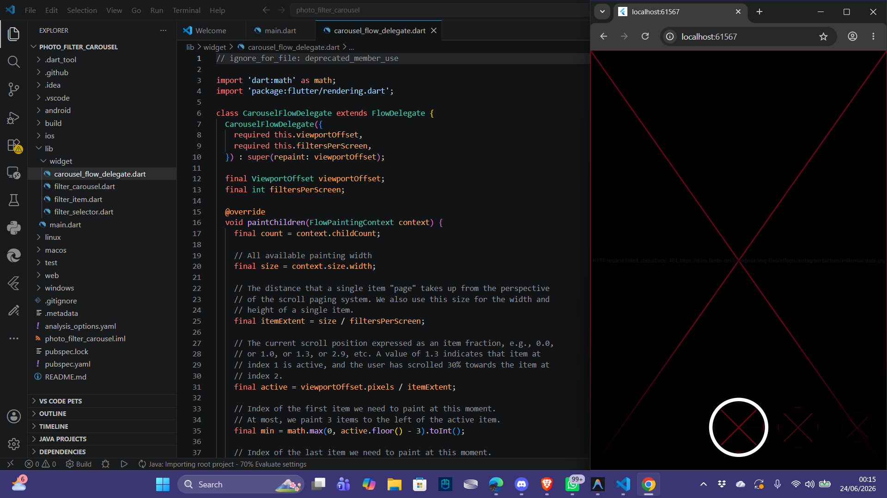

# Laporan Praktikum Pertemuan 9: Membuat Photo Filter Carousel

| Atribut | Nilai |
| --- | --- |
| Nama | Ubaidillah Ulil Absor Abdala |
| NIM | 244107060158 |
| Kelas | SIB-2D |

## Langkah 1: Buat project baru
Buatlah project flutter baru di pertemuan 09 dengan nama `photo_filter_carousel`.

Project berhasil dibuat dengan menjalankan perintah berikut di terminal direktori `Pertemuan 9`:
```bash
flutter create photo_filter_carousel
```

## Langkah 2: Buat widget Selector ring dan dark gradient

Buat file baru `lib/widget/filter_selector.dart` yang mengelola filter carousel. Di dalamnya terdapat inisialisasi controller halaman (`PageController`), shadow gradient (`_buildShadowGradient`), carousel itu sendiri (`_buildCarousel`), dan selection ring (`_buildSelectionRing`) yang diletakkan di tengah-tengah carousel.

### **Membuat File `lib/widget/filter_selector.dart`**
Buat file baru di path tersebut dengan isi kode berikut:

```dart
import 'package:flutter/material.dart';
import 'package:flutter/rendering.dart';
import 'filter_item.dart';
import 'carousel_flow_delegate.dart';

@immutable
class FilterSelector extends StatefulWidget {
  const FilterSelector({
    super.key,
    required this.filters,
    required this.onFilterChanged,
    this.padding = const EdgeInsets.symmetric(vertical: 24),
  });

  final List<Color> filters;
  final void Function(Color selectedColor) onFilterChanged;
  final EdgeInsets padding;

  @override
  State<FilterSelector> createState() => _FilterSelectorState();
}

class _FilterSelectorState extends State<FilterSelector> {
  static const _filtersPerScreen = 5;
  static const _viewportFractionPerItem = 1.0 / _filtersPerScreen;

  late final PageController _controller;
  late int _page;

  int get filterCount => widget.filters.length;

  Color itemColor(int index) => widget.filters[index % filterCount];

  @override
  void initState() {
    super.initState();
    _page = 0;
    _controller = PageController(
      initialPage: _page,
      viewportFraction: _viewportFractionPerItem,
    );
    _controller.addListener(_onPageChanged);
  }

  void _onPageChanged() {
    final page = (_controller.page ?? 0).round();
    if (page != _page) {
      _page = page;
      widget.onFilterChanged(widget.filters[page]);
    }
  }

  void _onFilterTapped(int index) {
    _controller.animateToPage(
      index,
      duration: const Duration(milliseconds: 450),
      curve: Curves.ease,
    );
  }

  @override
  void dispose() {
    _controller.dispose();
    super.dispose();
  }

  @override
  Widget build(BuildContext context) {
    return Scrollable(
      controller: _controller,
      axisDirection: AxisDirection.right,
      physics: const PageScrollPhysics(),
      viewportBuilder: (context, viewportOffset) {
        return LayoutBuilder(
          builder: (context, constraints) {
            final itemSize = constraints.maxWidth * _viewportFractionPerItem;
            viewportOffset
              ..applyViewportDimension(constraints.maxWidth)
              ..applyContentDimensions(0.0, itemSize * (filterCount - 1));

            return Stack(
              alignment: Alignment.bottomCenter,
              children: [
                _buildShadowGradient(itemSize),
                _buildCarousel(
                  viewportOffset: viewportOffset,
                  itemSize: itemSize,
                ),
                _buildSelectionRing(itemSize),
              ],
            );
          },
        );
      },
    );
  }

  Widget _buildShadowGradient(double itemSize) {
    return SizedBox(
      height: itemSize * 2 + widget.padding.vertical,
      child: const DecoratedBox(
        decoration: BoxDecoration(
          gradient: LinearGradient(
            begin: Alignment.topCenter,
            end: Alignment.bottomCenter,
            colors: [
              Colors.transparent,
              Colors.black,
            ],
          ),
        ),
        child: SizedBox.expand(),
      ),
    );
  }

  Widget _buildCarousel({
    required ViewportOffset viewportOffset,
    required double itemSize,
  }) {
    return Container(
      height: itemSize,
      margin: widget.padding,
      child: Flow(
        delegate: CarouselFlowDelegate(
          viewportOffset: viewportOffset,
          filtersPerScreen: _filtersPerScreen,
        ),
        children: [
          for (int i = 0; i < filterCount; i++)
            FilterItem(
              onFilterSelected: () => _onFilterTapped(i),
              color: itemColor(i),
            ),
        ],
      ),
    );
  }

  Widget _buildSelectionRing(double itemSize) {
    return IgnorePointer(
      child: Padding(
        padding: widget.padding,
        child: SizedBox(
          width: itemSize,
          height: itemSize,
          child: const DecoratedBox(
            decoration: BoxDecoration(
              shape: BoxShape.circle,
              border: Border.fromBorderSide(
                BorderSide(width: 6, color: Colors.white),
              ),
            ),
          ),
        ),
      ),
    );
  }
}
```

### **Penjelasan Langkah-Langkah:**
1. **`PageController`**: Berfungsi untuk melacak posisi geser/scroll pada filter. Memiliki properti `viewportFraction` untuk membatasi ukuran lebar satu item filter di layar (sebesar 1/5 lebar layar).
2. **`Flow` & `CarouselFlowDelegate`**: Memanfaatkan widget `Flow` untuk tata letak performa tinggi saat menempatkan dan menggerakkan item filter secara horizontal berdasarkan offset scroll.
3. **Selection Ring & Shadow Gradient**: Selection Ring berupa lingkaran putih solid statis yang diposisikan di paling atas menggunakan `Stack` untuk menandai filter yang sedang aktif, sedangkan shadow gradient memberikan efek bayangan gelap gradasi di bagian bawah.

## Langkah 3: Buat widget photo filter carousel

Buat file baru `lib/widget/filter_carousel.dart` untuk menyatukan gambar yang akan difilter dengan selector filter (`FilterSelector`) dalam satu layar. Di sini kita menggunakan `Stack` dan `Positioned.fill` untuk menampilkan gambar secara penuh di latar belakang dan meletakkan filter selector di atasnya pada bagian bawah layar.

### **Membuat File `lib/widget/filter_carousel.dart`**
Buat file baru di path tersebut dengan isi kode berikut:

```dart
import 'package:flutter/material.dart';
import 'filter_selector.dart';

@immutable
class PhotoFilterCarousel extends StatefulWidget {
  const PhotoFilterCarousel({super.key});

  @override
  State<PhotoFilterCarousel> createState() => _PhotoFilterCarouselState();
}

class _PhotoFilterCarouselState extends State<PhotoFilterCarousel> {
  final _filters = [
    Colors.white,
    ...List.generate(
      Colors.primaries.length,
      (index) => Colors.primaries[(index * 4) % Colors.primaries.length],
    )
  ];

  final _filterColor = ValueNotifier<Color>(Colors.white);

  void _onFilterChanged(Color value) {
    _filterColor.value = value;
  }

  @override
  Widget build(BuildContext context) {
    return Material(
      color: Colors.black,
      child: Stack(
        children: [
          Positioned.fill(
            child: _buildPhotoWithFilter(),
          ),
          Positioned(
            left: 0.0,
            right: 0.0,
            bottom: 0.0,
            child: _buildFilterSelector(),
          ),
        ],
      ),
    );
  }

  Widget _buildPhotoWithFilter() {
    return ValueListenableBuilder(
      valueListenable: _filterColor,
      builder: (context, color, child) {
        // Anda bisa ganti dengan foto Anda sendiri
        return Image.network(
          'https://docs.flutter.dev/cookbook/img-files'
          '/effects/instagram-buttons/millennial-dude.jpg',
          color: color.withOpacity(0.5),
          colorBlendMode: BlendMode.color,
          fit: BoxFit.cover,
        );
      },
    );
  }

  Widget _buildFilterSelector() {
    return FilterSelector(
      onFilterChanged: _onFilterChanged,
      filters: _filters,
    );
  }
}
```

### **Penjelasan Langkah-Langkah:**
1. **`ValueNotifier<Color>`**: Digunakan untuk menyimpan dan melacak warna filter yang aktif. Menggunakan `ValueNotifier` agar kita dapat me-refresh widget gambar secara efisien saat nilainya berubah tanpa memanggil `setState()` di seluruh carousel widget.
2. **`ValueListenableBuilder`**: Mendengarkan perubahan dari `_filterColor`. Setiap kali warna filter digeser atau diubah di carousel, widget builder ini dipicu untuk menggambar ulang gambar dengan filter warna yang baru.
3. **`Image.network` Filter Blend**: Gambar memuat URL eksternal dan menerapkan properti `color: color.withOpacity(0.5)` serta `colorBlendMode: BlendMode.color` untuk mensimulasikan efek filter warna di atas foto (seperti instagram filter).

## Langkah 4: Membuat filter warna - bagian 1

Buat file `lib/widget/carousel_flow_delegate.dart` yang mengimplementasikan `FlowDelegate`. Kelas ini bertugas untuk menghitung, memosisikan, dan merender item anak (filter-filter) di dalam widget `Flow` secara dinamis berdasarkan posisi geser scroll (`ViewportOffset`).

### **Membuat File `lib/widget/carousel_flow_delegate.dart`**
Buat file baru di path tersebut dengan isi kode berikut:

```dart
import 'dart:math' as math;
import 'package:flutter/material.dart';
import 'package:flutter/rendering.dart';

class CarouselFlowDelegate extends FlowDelegate {
  CarouselFlowDelegate({
    required this.viewportOffset,
    required this.filtersPerScreen,
  }) : super(repaint: viewportOffset);

  final ViewportOffset viewportOffset;
  final int filtersPerScreen;

  @override
  void paintChildren(FlowPaintingContext context) {
    final count = context.childCount;

    // All available painting width
    final size = context.size.width;

    // The distance that a single item "page" takes up from the perspective
    // of the scroll paging system. We also use this size for the width and
    // height of a single item.
    final itemExtent = size / filtersPerScreen;

    // The current scroll position expressed as an item fraction, e.g., 0.0,
    // or 1.0, or 1.3, or 2.9, etc. A value of 1.3 indicates that item at
    // index 1 is active, and the user has scrolled 30% towards the item at
    // index 2.
    final active = viewportOffset.pixels / itemExtent;

    // Index of the first item we need to paint at this moment.
    // At most, we paint 3 items to the left of the active item.
    final min = math.max(0, active.floor() - 3).toInt();

    // Index of the last item we need to paint at this moment.
    // At most, we paint 3 items to the right of the active item.
    final max = math.min(count - 1, active.ceil() + 3).toInt();

    // Generate transforms for the visible items and sort by distance.
    for (var index = min; index <= max; index++) {
      final itemXFromCenter = itemExtent * index - viewportOffset.pixels;
      final percentFromCenter = 1.0 - (itemXFromCenter / (size / 2)).abs();
      final itemScale = 0.5 + (percentFromCenter * 0.5);
      final opacity = 0.25 + (percentFromCenter * 0.75);

      final itemTransform = Matrix4.identity()
        ..translate((size - itemExtent) / 2)
        ..translate(itemXFromCenter)
        ..translate(itemExtent / 2, itemExtent / 2)
        ..multiply(Matrix4.diagonal3Values(itemScale, itemScale, 1.0))
        ..translate(-itemExtent / 2, -itemExtent / 2);

      context.paintChild(
        index,
        transform: itemTransform,
        opacity: opacity,
      );
    }
  }

  @override
  bool shouldRepaint(covariant CarouselFlowDelegate oldDelegate) {
    return oldDelegate.viewportOffset != viewportOffset;
  }
}
```

### **Penjelasan Langkah-Langkah:**
1. **`FlowDelegate`**: Delegate khusus yang digunakan oleh widget `Flow` untuk mengontrol posisi anak-anaknya secara efisien dengan melakukan translasi dan transformasi matriks secara langsung di tingkat rendering.
2. **Transformasi Skala & Opacity**: Menggunakan perhitungan matematika berdasarkan seberapa jauh posisi suatu item filter dari titik pusat layar (`percentFromCenter`). Semakin dekat ke pusat, ukurannya semakin besar (`itemScale` mendekati 1.0) dan semakin jelas (`opacity` mendekati 1.0).
3. **`Matrix4.identity()`**: Digunakan untuk membangun transformasi 3D (translasi, skala, dll) dari setiap anak widget guna memberikan animasi transisi perpindahan melingkar yang halus dan interaktif saat digeser.

## Langkah 5: Membuat filter warna - bagian 2 (FilterItem)

Buat file baru `lib/widget/filter_item.dart` untuk mewakili sebuah item filter lingkaran di dalam carousel. Setiap item menampilkan thumbnail/tekstur gambar dengan overlay warna filter tertentu menggunakan `BlendMode.hardLight` dan mendeteksi ketukan (tap) menggunakan `GestureDetector`.

### **Membuat File `lib/widget/filter_item.dart`**
Buat file baru di path tersebut dengan isi kode berikut:

```dart
import 'package:flutter/material.dart';

@immutable
class FilterItem extends StatelessWidget {
  const FilterItem({
    super.key,
    required this.color,
    this.onFilterSelected,
  });

  final Color color;
  final VoidCallback? onFilterSelected;

  @override
  Widget build(BuildContext context) {
    return GestureDetector(
      onTap: onFilterSelected,
      child: AspectRatio(
        aspectRatio: 1.0,
        child: Padding(
          padding: const EdgeInsets.all(8),
          child: ClipOval(
            child: Image.network(
              'https://docs.flutter.dev/cookbook/img-files'
              '/effects/instagram-buttons/millennial-texture.jpg',
              color: color.withOpacity(0.5),
              colorBlendMode: BlendMode.hardLight,
            ),
          ),
        ),
      ),
    );
  }
}
```

### **Penjelasan Langkah-Langkah:**
1. **`GestureDetector`**: Mendeteksi gestur ketuk (`onTap`) pada item filter. Ketika salah satu item filter di carousel diketuk, callback `onFilterSelected` dipanggil untuk menggeser carousel ke halaman filter tersebut.
2. **`ClipOval`**: Memotong gambar thumbnail filter agar berbentuk bulat lingkaran sempurna sehingga menyerupai bentuk tombol filter pada umumnya.
3. **`BlendMode.hardLight`**: Menerapkan mode perpaduan warna (color blend) bertipe *hard light* di atas gambar tekstur asli (`millennial-texture.jpg`) untuk mensimulasikan preview hasil filter warna yang realistis.

## Langkah 6: Update main.dart untuk Menggunakan PhotoFilterCarousel

Kita mengedit file `lib/main.dart` untuk menggunakan `PhotoFilterCarousel` sebagai halaman utama (`home`) aplikasi agar dapat menjalankan dan menampilkan filter carousel.

### **Perubahan di `lib/main.dart`**
Ubah file `lib/main.dart` dengan kode berikut:

```dart
import 'package:flutter/material.dart';
import 'widget/filter_carousel.dart';

void main() {
  runApp(
    const MaterialApp(
      home: PhotoFilterCarousel(),
      debugShowCheckedModeBanner: false,
    ),
  );
}
```

### **Penjelasan Langkah-Langkah:**
1. **`PhotoFilterCarousel`**: Widget utama yang membungkus gambar aslinya dan pemilih filternya (`FilterSelector`).
2. **`debugShowCheckedModeBanner: false`**: Menyembunyikan label "DEBUG" di pojok kanan atas agar antarmuka pengguna terlihat lebih bersih.

---

# Dokumentasi

